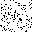
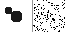

# noiseRecon

Experimental C++ project for reconstructing 2D fields from noisy sensor measurements.

## What it does

The program simulates a simple forward problem: you have a 2D field (representing liquid gas bubble mixture) take measurements with virtual sensors, add noise, and then try to reconstruct the original field from those noisy measurements.

Main components:
- 2D field representation with bubble shapes
- Forward projection using random measurement matrix
- Gaussian noise model
- Basic Monte Carlo reconstruction algorithm
- PPM image output for visualization

## Current Results

Here's what the reconstruction looks like with 100 sensors:

**Ground Truth (original field with bubbles):**


**Reconstructed Field:**



**Side-by-side Comparison:**



As you can see, the reconstruction is not good at all. This is expected because:
- The problem is severely underdetermined (1024 pixels, 100 measurements)
- Simple Monte Carlo search has no gradient information
- No regularization is applied

This demonstrates why sophisticated methods (proper optimization, regularization, machine learning) are needed for real EIT applications.

## Building

Requirements:
- C++17 compiler
- CMake

Build steps:
```bash
cmake -S . -B build
cmake --build build
```

Run:
```bash
./build/noiseReckon
```

The program wll generate PPM image files that you can view in any browser or image viewer. (I used [ppm-pgm-viewer](#https://marketplace.visualstudio.com/items?itemName=ngtystr.ppm-pgm-viewer-for-vscode) in vscode)
## Parameters

You can adjust these in `src/main.cpp`:
- `WIDTH`, `HEIGHT` - field dimensions (default 32x32)
- `TOTAL_SENSOR` - number of sensors (default 100)
- `NOISE_VARIABLE` - noise standard deviation (default 5.0)
- `TOTAL_ITERATIONS` - reconstruction iterations (default 1000)

## Project Structure
```
noiseRecon/
├── src/
│   ├── field/           - 2D field representation
│   ├── forward/         - Forward projection and measuremetns
│   ├── noise/           - Noise model
│   ├── reconstruction/  - Reconstruction algorithm
│   └── visualize/       - PPM image generation
└── CMakeLists.txt
```

## What's Next

I'm planning to explore a few things to improve this project:

**Short term:**
- Add error visualization (maybe a heatmap showing where reconstruction fails)
- Implement simulated to improve the search
- Test with different sensor configurations and noise levels to compare different levels
- Add quantitative metrics

**Longer term learning goals:**
- Try gradient based optimization methods
- Experiment with basic regularization techniques
- Compare different forward models

The goal is of course not to solve the inverse problem completely, that's research level work most possibly quite impossible without joint work, but to understand the different approaches and their trade offs better.
